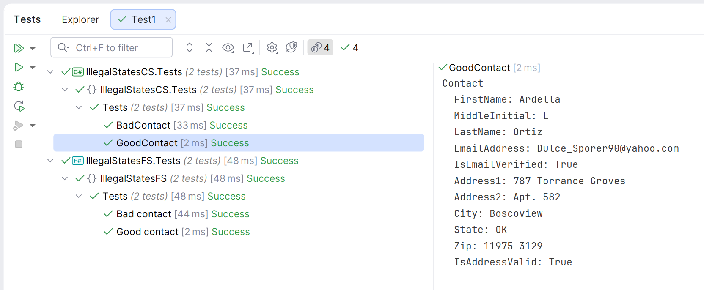
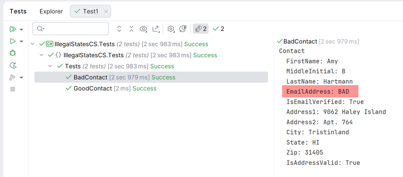
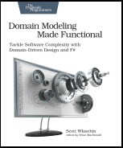

# Illegal States

Code for a lightning talk on making illegal states unrepresentable in C# and F#.

The code follows Scott Wlashin's excellent [Designing with types](https://fsharpforfunandprofit.com/posts/designing-with-types-intro/#series-toc) blog series.

There are tests for each language, but these don't assert that the code is correct, they just show the shape of the data in the console:





# How to follow

Start at the `main` branch, then follow the branches by number. 

## Main

This is the starting point.  It shows a naive implementation of a contact type and how that's not safe.

```csharp
public record Contact
{
    public string FirstName     { get; init; } = "";
    public string MiddleInitial { get; init; } = "";
    public string LastName      { get; init; } = "";

    public string EmailAddress  { get; init; } = "";
    public bool IsEmailVerified { get; init; }
    
    public string Address1 { get;      init; } = "";
    public string Address2 { get;      init; } = "";
    public string City     { get;      init; } = "";
    public string State    { get;      init; } = "";
    public string Zip      { get;      init; } = "";
    public bool IsAddressValid { get; init; }
}
```

# Links

- [Designing with types](https://fsharpforfunandprofit.com/posts/designing-with-types-intro/#series-toc)
- [Yaron Minsky from Jane Street (who coined the phrase 'making illegal states unrepresentable')](https://blog.janestreet.com/effective-ml-revisited/)
- [Sudhir Mangla's article on Developers Voice which take it further using C#](https://developersvoice.com/blog/oops/modern_csharp_beyond_solid_patterns/)
- [Railway oriented programming in F# (follows up from the last section of Sudhir's blog above)](https://fsharpforfunandprofit.com/rop/)
- [Vogen](https://github.com/SteveDunn/Vogen)
- [Kahlid Amuhakmeh's blog about Vogen](https://khalidabuhakmeh.com/vogen-and-value-objects-with-csharp-and-dotnet)
- [Briain Chavez's  wonderful Bogus library which generates the data for us](https://github.com/bchavez/Bogus)

# Bonus Ball

Scott Wlashin's series is really about domain modelling.  The last section of the series presents a more meaningful challenge:

“A contact must have at least one of the following: an email, a postal address, a home phone, or a work phone”_

https://fsharpforfunandprofit.com/posts/designing-with-types-discovering-the-domain/

His book is excellent too!



https://fsharpforfunandprofit.com/books/