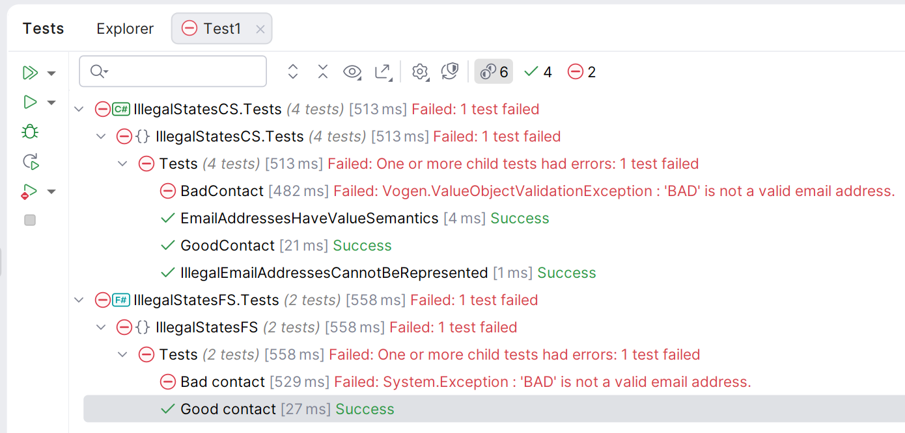

# Illegal States

Code for a lightning talk on making illegal states unrepresentable in C# and F#.

The code follows Scott Wlashin's excellent [Designing with types](https://fsharpforfunandprofit.com/posts/designing-with-types-intro/#series-toc) blog series.

There are tests for each language, but these don't assert that the code is correct, they just show the shape of the data in the console:


# How to follow

Start at the `main` branch, then follow the branches by number. 

## Main

This is the starting point.  It shows a naive implementation of a contact type and how that's not safe.

## 1 -better-type-factoring

This branch just factors the types out a little better.

```csharp
public record Contact
{
    public string FirstName     { get; init; } = "";
    public string MiddleInitial { get; init; } = "";
    public string LastName      { get; init; } = "";

    public string EmailAddress  { get; init; } = "";
    public bool IsEmailVerified { get; init; };
    
    public string Address1 { get;      init; } = "";
    public string Address2 { get;      init; } = "";
    public string City     { get;      init; } = "";
    public string State    { get;      init; } = "";
    public string Zip      { get;      init; } = "";
    public bool IsAddressValid { get; init; };
}
```
goes to

```csharp
public record PersonalName
{
    public string FirstName     { get; init; } = "";
    public string MiddleInitial { get; init; } = "";
    public string LastName      { get; init; } = "";
}

public record EmailContactInfo
{
    public string EmailAddress  { get; init; } = "";
    public bool IsEmailVerified { get; init; }
}

public record Address
{
    public string Address1 { get; init; } = "";
    public string Address2 { get; init; } = "";
    public string City     { get; init; } = "";
    public string State    { get; init; } = "";
    public string Zip      { get; init; } = "";
}

public record AddressContactInfo
{
    public Address Address { get; init; }
    public bool IsAddressValid { get; init; }
}

public record Contact
{
    public PersonalName Name { get; init; } = new();
    public EmailContactInfo EmailContactInfo { get; init; } = new();
    public AddressContactInfo AddressContactInfo { get; init; } = new();
}
```

## 2-removing-primitive-obsession

This is where we start to see how we can prevent illegal states being created in our domain.

To keep this talk "lighting", we just focus on preventing illegal states in the email address.

To do this, we use a defined type for the email address, `EmailAddress`.  In C#, 

```csharp
public record EmailContactInfo
{
    public EmailAddress EmailAddress    { get; init; }
    public bool         IsEmailVerified { get; init; }
}        
```

These should have value semantics, that is, two email addresses with the same string value should be equal.  In C#, we use the [Vogen](https://github.com/SteveDunn/Vogen).  

```csharp
[ValueObject<string>]
public readonly partial struct EmailAddress
{
    private static Validation Validate(string value) =>
        value.Contains('@') && value.Contains('.')
            ? Validation.Ok
            : Validation.Invalid("Email addresses must contain an @ and a domain separator.");
}
```

In F#, we do similar by making the `ctor` private:

```fsharp
type EmailAddress = private EmailAddress of string
```

Which means that only the module can create instances of `EmailAddress`:

```fsharp
// This does not compile!
EmailAddress("")

// This is fine
let emailAddress = EmailAddress.from "kenny@south.park".
```

This means that we can't create illegal states in our domain, and our previous tests fail. 🚀




# FAQ

## Why not just use \`readonly struct record\`?

<details>
<summary>You can, but Vogon adds some more value...</summary>

Dave Brock has a C# Advent Calendar blog post using readonly structs:

https://www.daveabrock.com/2025/12/07/parsing-santas-workshop-with-strongly-typed-data-without-the-coal/

### **Readonly Record Struct Approach** (Dave Abrock's article)
- **Manual implementation** - you write the type yourself
- **Type safety** - prevents mixing up domain concepts (e.g., `ElfId` vs `GiftId`)
- **Value semantics** - automatic equality comparison based on value
- **Performance** - stack-allocated, no GC pressure
- **No built-in validation** - you must manually validate everywhere you use it
- **Can use `new()` and `default`** - nothing stops invalid instances being created

### **Vogen's Additional Capabilities**

1. **Enforced Validation**: Vogen's biggest advantage is centralized, enforced validation through a static `Validate` method that runs automatically:

```csharp
[ValueObject<int>]
public partial struct Age {
    public static Validation Validate(int value) =>
        value > 0 ? Validation.Ok : Validation.Invalid("Must be greater than zero.");
}
```

2. **Code Analysis Protection**: Vogen adds **compilation errors** to prevent invalid construction:
    - Cannot use `new Age()` (error VOG010)
    - Cannot use `default(Age)` (error VOG009)
    - Cannot create your own constructors (error VOG008)
    - Cannot use reflection/Activator (error VOG025)

3. **Automatic Serialization**: Built-in converters for System.Text.Json, Newtonsoft.Json, Dapper, EFCore, LINQ to DB, MongoDB, etc.

4. **Normalization**: Optional `NormalizeInput` method to sanitize values on construction

5. **Named Instances**: Create well-known instances like `Age.Unspecified`:

```csharp
[ValueObject]
[Instance("Unspecified", -1)]
public readonly partial struct Age { }
```

6. **Consistent API**: All VOs use `From()` factory method for construction, ensuring validation runs

### Bottom Line

**Use readonly record struct when**: You need simple type safety without validation requirements.

**Use Vogen when**: You need validation, want to prevent invalid state at compile-time, and need comprehensive serialization support. Vogen essentially enforces domain-driven design principles through code analysis.

</details>


# Links

- [Designing with types](https://fsharpforfunandprofit.com/posts/designing-with-types-intro/#series-toc)
- [Yaron Minsky from Jane Street (who coined the phrase 'making illegal states unrepresentable')](https://blog.janestreet.com/effective-ml-revisited/)
- [Sudhir Mangla's article on Developers Voice which take it further using C#](https://developersvoice.com/blog/oops/modern_csharp_beyond_solid_patterns/)
- [Railway oriented programming in F# (follows up from the last section of Sudhir's blog above)](https://fsharpforfunandprofit.com/rop/)
- [Vogen](https://github.com/SteveDunn/Vogen)
- [Kahlid Amuhakmeh's blog about Vogen](https://khalidabuhakmeh.com/vogen-and-value-objects-with-csharp-and-dotnet)
- [Briain Chavez's  wonderful Bogus library which generates the data for us](https://github.com/bchavez/Bogus) 

# Bonus Ball

Scott Wlashin's series is really about domain modelling.  The last section of the series presents a more meaningful challenge:

“A contact must have at least one of the following: an email, a postal address, a home phone, or a work phone”_

https://fsharpforfunandprofit.com/posts/designing-with-types-discovering-the-domain/

His book is excellent too!


https://fsharpforfunandprofit.com/books/

